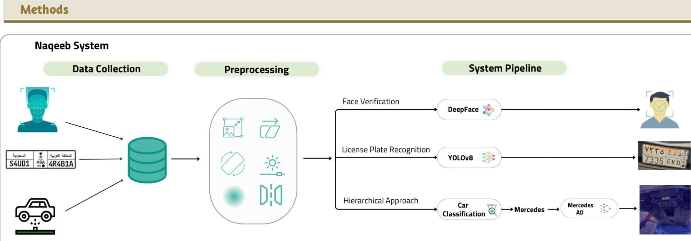

# Naqeeb
An automated multi-modal surveillance system for enhanced vehicle inspection and security.

## Overview
Naqeeb addresses the limitations of manual vehicle inspections through integrated deep learning models for comprehensive security screening.

## Key Features
- Automated under-vehicle inspection
- Real-time threat detection
- ID verification system
- License and insurance status validation

## Technical Performance
- License Plate Recognition: 98% mAP@50
- Face Verification: 94% F1 score 
- Under-vehicle Anomaly Detection:
  - Detection: 86% F1 score
  - Localization: 92% AP

## Datasets
- Structure Classification: [https://www.kaggle.com/datasets/wedyanessam/classification-dataset-final/settings]
- Under Vehicle Anomaly Detection: [https://drive.google.com/drive/folders/1-NeszshQlCCHooM7yQa5C043uyqKTNtJ?usp=sharing]

## Methodology

## Notebooks
- [https://drive.google.com/drive/folders/1jqhjS03B0U46ZKbkMRYo-dPLAn53FMQn]
